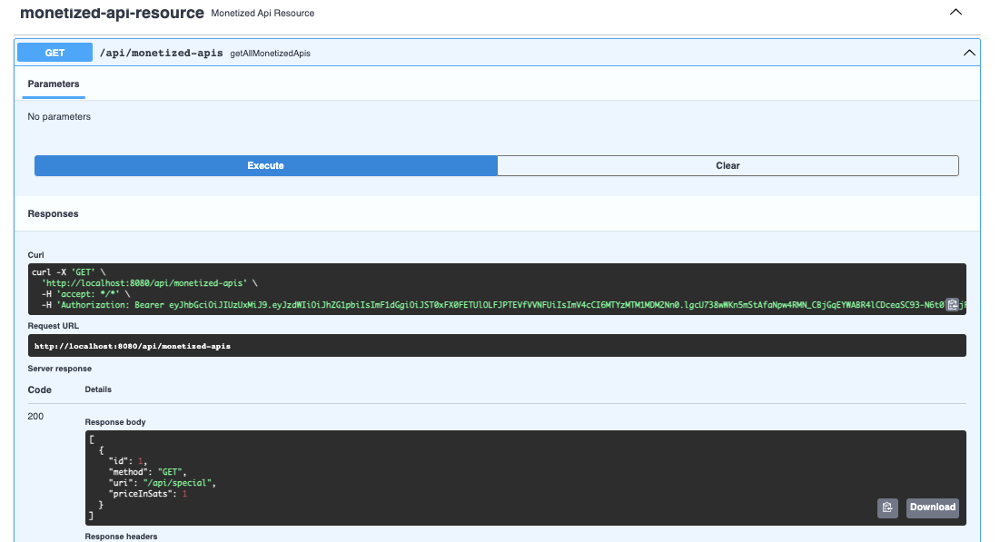
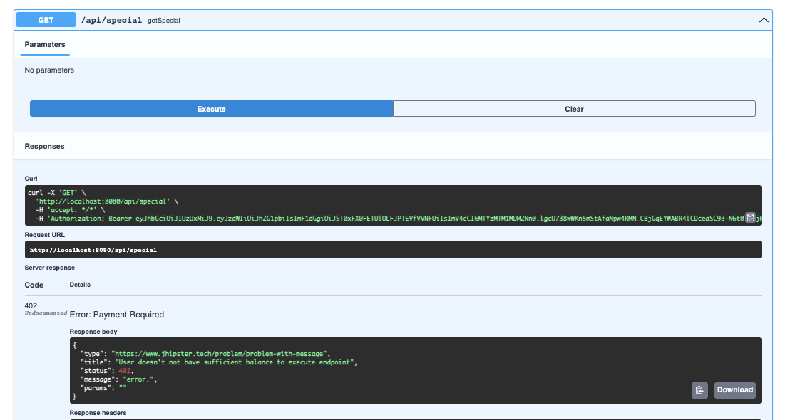
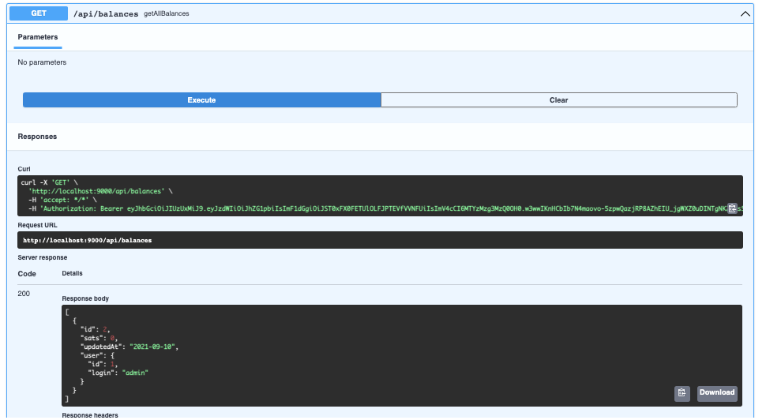
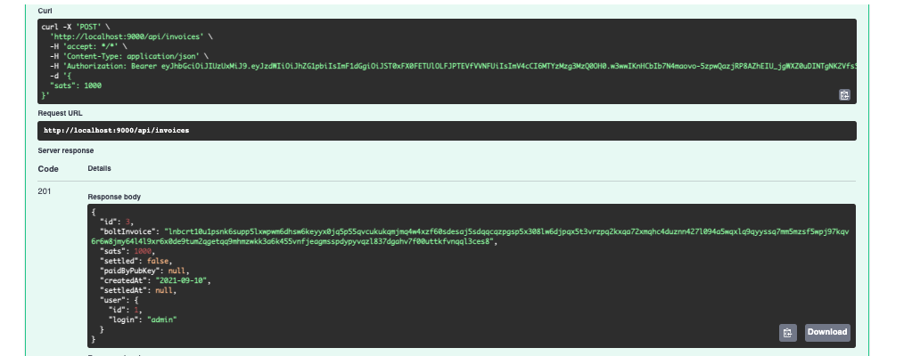
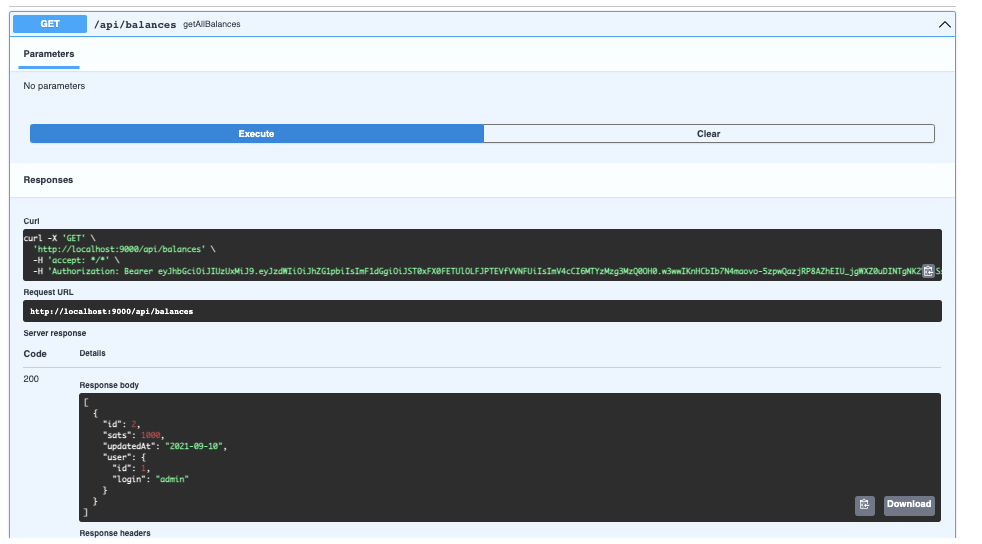
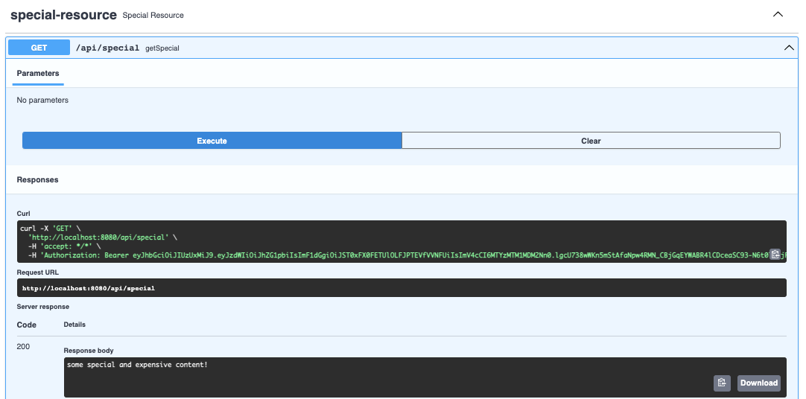
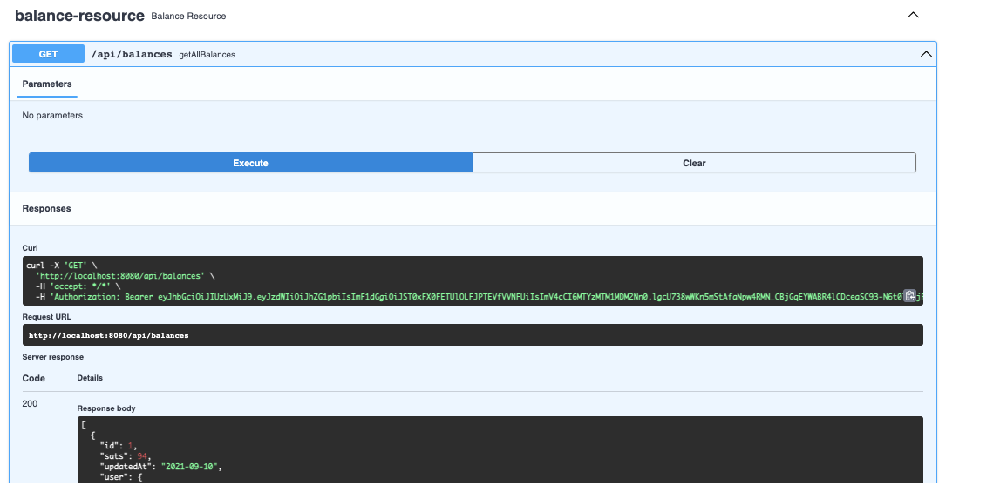

# bolt11-lightning-monitized-api

This app allows an admin user to configure some of the apis in the apps as MonetizedApi's and specifying a price in sats to invoke them.

Non admin users must have a sufficient balance in sats to access such apis.

A user registers a balance by using the app to generate a Bolt 11 invoice that they can then pay outside of the app. 

If the invoice has been paid then this will be resolved by the app and the users balance will be credited.

The user can now access any apis that have been monetized by the admin and their balance is decremented by the appropriate number of sats (depending on the price confifigured for that api by the admin) after every invocation.

Invocations of monetized apis are also recorded on a user basis for any auditing purposes.

If a user does not have a sifficent balance to invoke an api then a 402 Http code is returned in the response: https://developer.mozilla.org/en-US/docs/Web/HTTP/Status/402

## Example

Api's currently configured as monetized:

Trying to invoke monetized api with insufficient balance:

Checking current empty balance:

Generating a Bolt invoice to pay/deposit:

Checking current balance after payment of invoice:

Accessing with sufficient balance:

Checking current balance after successfully invoking monetized apis:

Notes:

App built using JHipster stack React.js, Spring Boot, MySQL.

App requires access to an Impervious Node (https://www.impervious.ai/) which in turn needs to be hooked up to a BTC lightning node.

Polar (https://lightningpolar.com/) can be used to run a local lightning node for development.

Impervious code is encapsulated in ImperviousLightningService.java and hardcoded to access Impervious node at http://127.0.0.1:8882

A `BalanceInterceptor` (impl of org.springframework.web.servlet.HandlerInterceptor) runs preHandles any request to apis to check if they are monetized. If they are monetized then it checks if the user has sufficient balance. If the user has no sufficient balance it proceeds to check any unsettled invoices that the user has associated with them.

The BalanceInterceptor also 'charges' the user the required number of sats in the `postHandle` method as well as recording the invation of the api.
